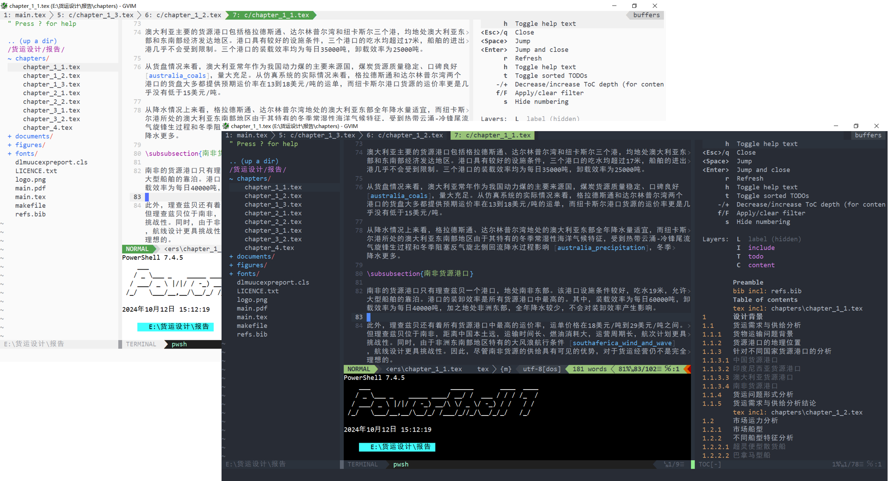

# 适用于 Windows 的 gVim 个性化配置

## 项目描述

这个项目保存的是我的个性化 Vim 配置，**适用于 gVim 9.1 或以上版本，Windows 操作系统**。我将代码开源出来一方面是方便我自己使用、迁移和保存设置，另一方面也能给其他人提供 Vim 配置的代码方案参照。配置效果示例如图所示。

{#fig:demo width=12cm}

众所周知，在 Windows 平台上配置 gVim 会遭遇各种各样奇奇怪怪的兼容性问题，包括但不限于：

1. 你不可能像在 GNU/Linux 上面那样把配置和安装的插件放在你的用户主目录下，因为 Windows 上的用户主目录总是在 C 盘。如果这样操作，C 盘就会爆盘；
2. 如果希望计算机上的多个用户共享 Vim 配置，也会因为 Vim 被安装到 `Program Files` 目录下而遇到路径管理困难的问题。
3. 当你在 Windows 上使用 Cygwin、MingW、MSYS 2 之类的子系统的时候，Vim Script 中的很多代码实现会遇到兼容性问题，比如 `execute` 命令后 `$VIM`、`$VIMRUNTIME` 的解析会出现无法处理反斜杠 `\` 的情况。
4. Windows 平台上使用 Windows CMD 作为终端 shell 的时候，不支持使用 `~` 指定用户的主目录，这就导致了配置移植困难。
5. 诸如此类，以及更多诸如此类。

为了避免这些乱七八糟的问题，本配置当中采用了一连串磕磕绊绊的兼容性措施，比如将配置安装位置奇特地选定为 Vim 的安装目录，即 `$VIMRUNTIME` 所指向的位置。

## 项目特性

相较于其他用户的 Vim 配置，我的配置的主要特点有：

1. 强大的写作环境，为 Markdown to PDF via \LaTeX 和 \LaTeX 语法提供了额外的支持（如不需要可以通过修改 `init/plugrc.vim` 配置，注释掉相应插件安装；同时修改 `init/runcode.vim` 中的 Markdown 编译命令去除和更改这部分内容。）
2. 专为 Windows 设计、配置文件本身及所有插件安置在 Vim 的安装目录下，不会让你的 C 盘容量变红爆炸。
3. 针对 Windows 上插件管理器时不时安装失效的问题，提前准备了部分插件的本地文件，以便手动安装；针对 Windows 上部分插件出现手动安装也装不上的情况提供了备选方案。
4. 针对 Windows 上 Airline 字体乱码的问题提供了专用的字体 `Consolas for Powerline`；同时兼容终端模式下采用其他 Nerd Font 字体。
6. 为中文的显示读写提供了额外的支持。
7. 为使用 Python 脚本扩展配置功能提供了额外的兼容。

配置入口在 `./init.vim`。从技术上说，理论上这个配置可以被移植到 Unix/Linux 或 Neovim。我尝试过注释掉其中的一部分插件功能以便在 Linux 平台上使用，效果良好，但是由于从来没有进行过完整迁移的尝试，因此不建议这样做。

## 配置功能

### 提供的功能与键位

#### 基础方案

: 本配置采用的基础设置风格

| 选配项       | 选配方案          |
| :----------: | :---------------: |
| 默认主题     | one               |
| 默认字体     | Consoals + SimHei |
| 默认引导键   | `\`               |
| 插件管理器   | Vim-Plug          |
| 文件管理器   | NERDTree          |
| 状态栏       | airline.vim       |
| 代码补全方案 | Coc.nvim          |
| 内部终端     | vim-terminal      |

#### 键位设置

: 配置提供的热键键位

| 按键                    | 功能                                 |
| :---------------------: | :----------------------------------: |
| `\l`                    | 切换主题亮暗模式                     |
| `\v`                    | 打开 markdown 侧边目录功能           |
| `\V`                    | 延长窗口并打开 markdown 侧边目录功能 |
| `Ctrl` + `N`            | 打开文件目录树                       |
| `\n`                    | 打开文件目录树                       |
| `\N`                    | 延长窗口打开文件目录树               |
| `\e`                    | 在文件管理器中打开当前目录           |
| `TAB` + `h`/`j`/`k`/`l` | 切换窗口                             |
| `F5`                    | （部分支持语言）编译运行             |
| `F6`                    | （部分支持语言）调试                 |

**Note**: 由各插件定义的默认功能热键不在此列。

### 个性化配置

#### 其他热键设置

本配置中所有的热键定义在 `./init/keymap.vim` 中，除了上述表格中列举的设置之外另有部分未被启用的可选方案，可以自行查看，或在现有配置的基础上进行扩展。

#### 自定义终端

本配置中的终端配置在文件 `./init/terminal.vim` 中。可以通过修改如下字典，个性化配置终端启动命令：

```vimscript
" 定义一个字典，存储不同终端的命令
let g:terminals = {
\ 'powershell': 'powershell',
\ 'pwsh': 'pwsh',
\ 'cmd': 'cmd',
\ 'bash': 'bash --login -i',
\ 'zsh': 'zsh --login -i'
\ }
```

使用 `OpenTerminal(key)` 函数启动相应的终端。

### 功能脚本

#### Python 脚本

源于 Vim 强大的扩展能力，配置允许将额外的脚本集成到 Vim 当中。本配置方案为额外的 Python 脚本预留了槽位，可以放置在 `./init/python/` 目录下。

## 安装方式

### 手动安装

#### 安装步骤

如果自动安装不成功，您可以执行手动安装。在这种情况下，标准的安装流程包含 4 个步骤：

1. **导入配置**：包括配置文件本身、Vim-Plug 插件管理器以及无法用插件管理器安装的配色主题 one；
2. **安装字体文件**：Consoals for Powerline
3. **安装插件**：执行 `PlugInstall` 命令自动安装插件
4. **安装自动代码补全方案**：根据个人的实际需求执行 `CocInstall` 命令安装，此不赘述。

#### 导入配置

首先将以下文件夹复制到 Vim 安装目录（通常名为 `vim90`、`vim91`、`vim82`，etc）：

1. `autoload` 文件夹，其中包含用于安装插件的插件管理器 Vim-Plug 所需的 `plug.vim` 文件。
2. `colors` 文件夹，其中包括 one 主题的配色文件（one 主题通过插件管理器安装会出现无法正常工作的情况）。
3. `doc` 文件夹，包括用到的插件的文档文件。
4. `vimtweak64.dll`

其次，将以下文件夹复制到 Vim 的运行目录（与上述文件一样的目录）：

1. `./init.vim` 文件，是本配置的入口文件。
2. `./init` 文件夹，是本配置的附属文件的文件夹。
3. `./plugged` 文件夹，是 Vim-Plug 插件的安装目录。

在用户目录或 Vim 安装目录下创建 `.vimrc` 文件，文件中添加如下内容：

```vimscript
source $VIMRUNTIME/init.vim
```

#### 安装字体

安装 `./font` 文件夹下全部的 4 个字体文件。

#### 安装插件

直接在 Vim 中执行 `PlugInstall` 即可自动安装。

#### 安装自动补全方案

在 Coc.Nvim 中执行 `CocInstall` 命令安装代码补全方案。这部分内容根据个人需求操作，此不赘述。

### 自动安装

确保您的计算机上已经正确配置了 GNU Make 和 shellscript 的执行环境（在 Windows 上，这通常依赖 Cygwin、MingW、Msys2 或者 Git for Windows 之类的仿 Linux 兼容环境）

首先，同手动安装一样，你需要在你的计算机上安装提供的字体。然后修改配置文件 `./config.mk` 的内容，将 PREFIX 变量修改为您的计算机上的 Vim 安装路径，注意在 Windows 上需要与 Shell 的执行环境中的路径书写方式一致。例如在 Msys2 环境中，盘符记作 `/c`、`/d`、`/e` 样式。

```vim
PREFIX = /d/Vim/vim91
```

然后在项目目录下执行 `make install` 命令。


## 文件说明

本项目 `init.vim` 依赖的全部的 `.vim` 配置文件均位于 `init` 目录下，各个文件及其功能如下列所示：

- `init.vim` - 配置入口文件
- `init` - (子目录) 保存了项目配置的各项依赖文件
    - `keymaps` - (子目录) 保存了部分模块化的热键配置
        - `coclistkm.vim` - Coc.nvim 热键配置
        - `ipythonkm.vim` - 用于与 IPython 交互的热键配置
        - `nerdtreekm.vim` - 文件管理器功能热键配置
        - `termkm.vim` - Vim 内部终端热键配置
        - `vimwinkm.vim` - 窗口导航热键
    - `plugs` - (子目录) 保存了各个插件独立的配置
        - `airlinerc.vim` - Airline 插件的
        - `cocrc.vim` - Coc.nvim 自动补全插件
        - `mkdprc.vim` - Markdown 预览插件
        - `netrwrc.vim` - 自带的 Netrw 插件（几乎不用）
        - `slimerc.vim` - Slime 插件
        - `vimtexrc.vim` - VimTeX 插件
        - `vistarc.vim` - Markdown 导航目录插件
    - `python` - (子目录) 保存可供调用的 Python 脚本
        - (略) 
    - `color.vim` - 颜色和外观样式
    - `keymap.vim` - 全部的快捷键及部分快捷键的功能实现
    - `plugrc.vim` - 各个插件的安装及配置的导入
    - `runcode.vim` - 运行和调试代码功能的实现
    - `terminal.vim` - 一键开启终端功能的实现
    - `tocs.vim` - Markdown 和 TeX 目录展开和折叠功能的实现
    - `system.vim` - 用于处理 Windows 上的系统路径兼容问题

如有必要在现有配置的基础上对配置进行进一步的个性化修改，希望这些信息能够帮助你正确定位文件和目录。

## 存在的问题与解决

### 字体兼容

通常情况下，针对 Airline 插件使用 Powerline 字体的情况，我们一般直接去 [Powerline 字体的项目仓库](https://github.com/powerline/fonts/tree/master) 下载相应的字体。但是在 Windows 上，这样做会导致 Airline 的倒角处出现豆腐块或者不显示的情况。详情参照 StackExchange 上的提问 [Powerline fonts not working on Airline](https://vi.stackexchange.com/questions/10234/powerline-fonts-not-working-on-airline)，描述了相同的问题。

解决方案来自博客文章 [VIM配置:vim-airline插件安装](https://blog.csdn.net/the_victory/article/details/50638810) 这个博客文章已经是 8 年前的东西了，博主声称自己踩了很大的坑，但是并未详细解释为什么在 Windows 上不能使用 [原生的 Powerline 字体](https://github.com/powerline/fonts)，而是需要找额外的字体。我在网上找了很久也没能找到相应的解释，但是博客文章给出的方案确是可行的。

目前发现在 Windows 上的可用的字体及相应的仓库地址为：

1. [Consolas Powerline](https://github.com/eugeneching/consolas-powerline-vim)
2. [Ubunu Mono Powerline](https://github.com/scotu/ubuntu-mono-powerline)
3. [MesloLGS for Powerline](https://github.com/shumer1213/MesloLGS-for-Powerline)

### 中国用户在安装插件时连接不到 Github

针对中国地区的 Windows 用户连接不到 Github、插件下载安装遇到困难的情况，首先请自备需要上网工具。在此基础之上，请在 `C:\Windows\System32\drivers\etc\hosts` 文件下增加下面一行内容：

```
199.232.68.133 raw.githubusercontent.com
```

再执行 `PlugInstall` 即可。有的时候即使是这样也不能安装，则可以考虑反复执行 `PlugInstall` 重复 10 到 20 遍，耐心等待，直至所有插件正确安装。

## 关于

### 第三方许可证

项目仓库中保存的 Consolas Powerline 字体遵循的有关许可证文件位于 `./fonts` 目录下的 `LICENCE` 文件，请自行查看。

### 开源

本项目根据 MIT 许可证开源，具体请查看 `LICENCE` 文件。除此之外，如果你喜欢我的项目，别忘了帮我点亮小星星；如果对于配置的使用存在任何疑虑，欢迎 [提交 Issue](https://github.com/GitHubonline1396529/vim/issues/new)。项目开源地址：

- Github: [GitHubonline1396529/vim](https://github.com/GitHubonline1396529/vim)
- Gitee: [BOXonline_1396529/vimrc](https://gitee.com/BOXonline_1396529/vimrc)

点击链接前往访问。

